# Comprehensive Technical Project Dossier: JSL Stainless Steel Carbon & Energy Engine
**Competition:** Stainless Spark – Engineering Innovation, Building Futures  
**Host Organization:** Jindal Stainless Limited (JSL) on Unstop  
**Track:** Problem Statement 3 — Carbon and Energy Calculator for Steelmaking  
**Submitting Team:** Team NIT Raipur (National Institute of Technology Raipur, Chhattisgarh, India)  
**Team Composition:** 1 – 3 Members  
**System Name:** Physics-Informed JSL Stainless Steel Carbon & Energy Decision Engine (`jsl_carbon_engine`)  
**Current Status:** Version 2.2 Production-Grade | 70/70 Pytest Automated Tests Passing | 142/142 Frontend Tests Passing  

---

## 1. Executive Summary & Problem Scope

### 1.1 The Challenge
Jindal Stainless Limited (JSL) is India's largest stainless steel manufacturer, operating major production complexes in **Jajpur (Kalinganagar Industrial Complex, Odisha)** and **Hisar (Haryana)** with a combined melting capacity exceeding 3.0 MTPA. In the *Stainless Spark Case Study Competition 2026*, JSL challenged participating engineering institutions to develop a comprehensive Carbon and Energy Calculator for stainless steel manufacturing.

### 1.2 The Core Metallurgical Fallacy in Generic Calculators
Virtually all public carbon estimators (e.g., *SteelOnTheNet*, *Circular Ecology ICE*, *worldsteel Climate Action*, *Sphera GaBi*) model crude carbon steel ($\text{Fe} + \text{C}$) produced via the **Blast Furnace – Basic Oxygen Furnace (BF-BOF)** route. 

Applying crude carbon steel logic to Jindal Stainless is fundamentally flawed for three pyrometallurgical reasons:
1. **BF-BOF is Thermodynamically Unviable for Stainless:** In a standard BOF converter, blowing pure oxygen oxidizes chromium before carbon because the standard Gibbs free energy ($\Delta G^\circ$) of $\text{Cr}_2\text{O}_3$ formation is significantly more negative than $\text{CO}$ formation at typical melting temperatures ($1600^\circ\text{C}$). Refining stainless steel requires an **Electric Arc Furnace – Argon Oxygen Decarburization (EAF-AOD)** continuous casting route, where argon dilution lowers the partial pressure of $\text{CO}$ ($P_{\text{CO}}$), allowing preferential decarburization without vaporizing valuable chromium.
2. **Stainless Steel is an Alloy Business ($\text{Fe-Cr-Ni-Mo-Mn-Cu}$):** Stainless steels derive corrosion resistance, phase stability, and mechanical strength from high concentrations of alloying elements (e.g., 18% Cr and 8% Ni in J304; 22% Cr, 5% Ni, 3% Mo in J2205; 15.5% Cr, 1.5% Ni, 9.25% Mn in J4).
3. **Precursor Dominance (The Scope 3 Lever):** In crude carbon steel, 85% to 90% of emissions are on-site direct stack emissions (Scope 1) from coal/coke combustion in blast furnaces. In stainless steel, **65% to 75% of cradle-to-gate emissions originate upstream in the smelting of ferroalloys** (FeCr, FeMn, FeMo, and Nickel smelting in submerged arc furnaces).

### 1.3 Team NIT Raipur’s Differentiated Solution
Team NIT Raipur engineered `jsl_carbon_engine`, an enterprise-grade, physics-informed decision engine that replaces heuristic sliders with:
- **Closed-Loop Stoichiometric Mass Balance** enforcing exact $1.0000 \pm 0.0005\text{ t}$ liquid steel mass conservation with **Elemental Substitution Accounting** (crediting metallic iron delivered by ferroalloys).
- **Dynamic Thermodynamic EAF SEC Modeling** separating thermal melting enthalpy ($Q_{\text{thermal}}$) from electrical consumption ($SEC_e = Q/\eta + E_{\text{aux}}$), and capturing JSL Jajpur’s unique captive molten FeCr hot-charging credit ($-86.4\text{ kWh/t}$).
- **Continuous HiGHS Simplex LP Optimization** solving multi-objective least-cost / least-carbon charge mixes in $<45\text{ ms}$ under strict ASTM/JSL grade chemistry and tramp element ceilings.
- **Correlated 4D Monte Carlo Stochastic Risk Engine** ($N=1,000$) modeling scrap assay variance with $\text{Cr-Ni}$ and $\text{Cu-Sn}$ covariance to guarantee high compliance ($>98\%$).
- **Dual Regulatory Balance Sheet Integration** modeling EU CBAM (Regulation EU 2023/956) with Article 9 domestic price deductions and India CCTS performance against BEE June 2026 facility benchmarks.
- **Level-2 SCADA Pulpit Integration** ready for plant deployment via OPC-UA/MQTT protocols.

---

## 2. JSL Corporate Operating Footprint & Asset Calibration

Our engine is explicitly calibrated against JSL's actual corporate manufacturing assets and public regulatory disclosures:

| Asset / Parameter | Empirical Reality & Grounding | Engine Implementation |
| :--- | :--- | :--- |
| **JSL FY26 Corporate Baseline** | Disclosed in JSL Business Responsibility & Sustainability Report (BRSR): **$1.76\text{ tCO}_2\text{e/tcs}$** combined Scope 1+2 crude steel intensity. Recycled scrap utilization: **70.1%**; Renewable power share: **46.8%**. | Baseline calibration anchor; when inputs match JSL disclosures ($70.1\%$ scrap, $46.8\%$ RE, Jajpur CPP), the engine outputs exactly $1.76\text{ tCO}_2\text{e/tcs}$. |
| **Jajpur Complex (Odisha)** | 2.2 MTPA melting capacity. On-site 250 MW captive coal-fired power plant (CPP, $1.00\text{ tCO}_2/\text{MWh}$), 0.25 MTPA captive Submerged Arc Furnaces (molten FeCr delivered via ladles at $1600^\circ\text{C}$), and 315.6 MW hybrid renewable PPA (Oyster Renewable Energy, $0.03\text{ tCO}_2/\text{MWh}$). | Facility profile `jajpur` in [`jsl_facilities.py`](file:///C:/Users/Asus/Desktop/JSL/jsl_carbon_engine/config/jsl_facilities.py). Toggles molten FeCr hot charging (saving $-86.4\text{ kWh/t}$) and facility grid blending. |
| **Hisar Complex (Haryana)** | 0.8 MTPA specialty precision strip and coin blank mill. Connected to Northern Regional Grid ($0.72\text{ tCO}_2/\text{MWh}$). Features India's 1st commercial green hydrogen plant in stainless steel (Hygenco) for bright annealing. | Facility profile `hisar`. Models grid electricity emission factor and zero Scope 1 fuel emissions for hydrogen-fired annealing lines. |
| **Indonesian Nickel Asset** | JSL holds a 49% equity stake ($157M / ₹1,300 Cr) in a 200,000 MT/year coal-fired Rotary Kiln-Electric Furnace (RKEF) Nickel Pig Iron (NPI) facility at Halmahera (PT New Yaking). Coal RKEF NPI emits **$50.0\text{--}65.0\text{ tCO}_2/\text{t Ni}$**, compared to **$8.0\text{--}13.0\text{ tCO}_2/\text{t Ni}$** for Class 1 Hydro-powered Nickel. | Raw material selector `niNPI` vs `niClass1` vs `niStandard`. Sourcing Indonesian NPI for 304 shifts cradle-to-gate footprint by $+1.85\text{ tCO}_2/\text{t}$, addressing JSL's largest Scope 3 procurement lever. |
| **India CCTS Allocation** | Bureau of Energy Efficiency (BEE) June 2026 draft gazette notification for the Iron & Steel Sector under the Carbon Credit Trading Scheme (CCTS). | Facility benchmark for JSL Kalinga Nagar set at **$0.8222\text{ tCO}_2\text{e/t}$** equivalent product against a baseline of $0.8792\text{ tCO}_2\text{e/t}$. |

---

## 3. The Authentic 43-Grade JSL Metallurgical Library

Unlike generic calculators that offer "Stainless 304" and "Stainless 316", `jsl_carbon_engine` encodes **43 authentic commercial stainless steel grades** extracted directly from official Jindal Stainless Limited technical product datasheets (`200series.pdf`, `300series.pdf`, `400series.pdf`, `duplex-series.pdf`):

1. **200 Series (Lean-Austenitic / Cr-Mn Family — 9 grades):**
   - Grades: `J4`, `J4-16Cr`, `J201`, `J202`, `J204`, `J204Cu`, `J216L`, `JSL AUS`, `JSL U DD`.
   - *Metallurgical Feature:* High Manganese ($7.0\%\text{--}10.5\%\text{ Mn}$) and intentional Copper ($1.5\%\text{--}2.0\%\text{ Cu}$) replacing expensive Nickel ($1.0\%\text{--}4.5\%\text{ Ni}$). JSL is the global market leader in this series.
2. **300 Series (Austenitic & Heat-Resistant Family — 13 grades):**
   - Grades: `J301`, `J304`, `J304L`, `J305`, `J309S`, `J310S`, `J316`, `J317L`, `J321`, `J347`, `J904L`, `1.4835`, `1.4841`.
   - *Metallurgical Feature:* Classical $18/8$ and $18/10$ Cr-Ni stainless steels, molybdenum-bearing grades (`J316`, `J317L`), and high-temperature heat-resistant alloys (`1.4841` with $25\%\text{ Cr}, 20.5\%\text{ Ni}$).
3. **400 Series (Ferritic Family — 9 grades):**
   - Grades: `J409L`, `J410S`, `J430`, `J436L`, `J439`, `J441`, `J444`, `J445`, `1.4003`.
   - *Metallurgical Feature:* Nickel-free ($<0.50\%\text{ Ni}$) magnetic alloys. Prone to hot-shortness if tramp Nickel or Copper exceeds strict metallurgical limits; scrap ceilings physically clamped to $70\%$.
4. **400 Series (Martensitic Family — 6 grades):**
   - Grades: `J410`, `J410DB`, `J415`, `J420J1`, `J431`, `1.4116`.
   - *Metallurgical Feature:* Hardenable cutlery, razor blade, and turbine blade steels ($0.15\%\text{--}0.50\%\text{ C}$, $12.0\%\text{--}17.0\%\text{ Cr}$).
5. **Duplex & Super-Duplex Family — 6 grades):**
   - Grades: `J2101` (Lean Duplex), `J2304` (Lean Duplex), `J2205` (Standard Duplex, PREN $\ge 35$), `J31803`, `J2507` (Super Duplex, PREN $\ge 42$), `J32760` (Hyper Duplex with W).
   - *Metallurgical Feature:* 50/50 Austenite-Ferrite microstructure with high Nitrogen ($0.14\%\text{--}0.30\%\text{ N}$) and Molybdenum ($3.0\%\text{--}4.5\%\text{ Mo}$).
6. **Reference Baseline:**
   - `carbonRef`: Plain carbon steel baseline for benchmarking against BF-BOF competitors.

---

## 4. The 3-Layer Scientific Architecture

```mermaid
flowchart TD
    subgraph L1["Layer 1: First-Principles Physics & Metallurgy"]
        MB["Mass Balance: Elemental Substitution Accounting<br/>Credits Fe in FeCr (40%), NPI (81.5%), FeMo (33%), FeMn (20%)<br/>Mass Closure: 1.0000 ± 0.0005 t"]
        TH["Dynamic Thermodynamics: Sensible + Latent Heat Balance<br/>Scrap 420 kWh/t vs Coal DRI 680 kWh/t<br/>Jajpur Molten FeCr Sensible Heat Credit: -86.4 kWh/t"]
        SK["AOD Slag Kinetics: Cr2O3 Reduction Stoichiometry<br/>FeSi 75 Demand (8 kg/t kill floor) + Lime Basicity B2 >= 1.90"]
    end

    subgraph L2["Layer 2: Corporate Regulatory Economics"]
        GHG["GHG Protocol 3-Scope Accounting<br/>Scope 1: Stoichiometric AOD Decarb (Factor 1.0) + Reheat Fuel<br/>Scope 2: Jajpur CPP (1.00) vs Grid (0.72) + 315MW PPA (0.03)<br/>Scope 3: Precursor Upstream Smelting (FeCr, NPI, FeMo, DRI)"]
        CBAM["EU CBAM 2026-2034 Regulatory Engine<br/>Article 9 Domestic Carbon Deduction (€0.00 Cash Duty in 2026/27)<br/>2034 Unhedged Exposure (€180.80/t)"]
        CCTS["India CCTS Compliance Ledger<br/>BEE June 2026 Jajpur Benchmark (0.8222 tCO2e/t)<br/>+0.0822 tCO2e/t Surplus (+₹36.99 Cr/yr EBITDA Gain)"]
    end

    subgraph L3["Layer 3: Optimization & Risk Management"]
        LP["Continuous Simplex LP Optimizer (HiGHS Solver)<br/>Multi-Objective Pareto Frontier (Cost vs Carbon)<br/>Tramp Limits: Cu <= 0.50%, Sn <= 0.03%, Ni_ferritic <= 0.50%"]
        MC["Correlated 4D Monte Carlo Stochastic Engine (N=1,000)<br/>Multivariate Normal Covariance: rho(Cr,Ni)=0.65, rho(Cu,Sn)=0.45<br/>98.8% Chance-Constrained Compliance Probability"]
        SCADA["Level-2 SCADA Pulpit Interface & REST API<br/>FastAPI Server (Port 8000) | OPC-UA/MQTT Plant Protocols"]
    end

    L1 --> L2 --> L3
```



### Layer 1: First-Principles Physics Core
- **Elemental Substitution Accounting ([`mass_balance.py`](file:///C:/Users/Asus/Desktop/JSL/jsl_carbon_engine/core/mass_balance.py)):**  
  Standard calculators determine virgin iron by $(1 - \text{alloys})$, then add ferrochrome, ferromolybdenum, and ferromanganese. This double-counts iron and inflates charged mass to $1.073\text{ t/t}$. Our engine enforces:
  $$\text{Fe}_{\text{net}} = \max\left(0, \, (1-S)w_{\text{Fe}} - \sum_{j} f_{\text{Fe}, j} \cdot M_j\right)$$
  where $f_{\text{Fe},\text{FeCr}} = 40.0\%$, $f_{\text{Fe},\text{NPI}} = 81.5\%$, $f_{\text{Fe},\text{FeMo}} = 33.0\%$, and $f_{\text{Fe},\text{FeMn}} = 20.0\%$.
- **Dynamic Enthalpy Coupling ([`thermodynamics.py`](file:///C:/Users/Asus/Desktop/JSL/jsl_carbon_engine/core/thermodynamics.py)):**  
  Decouples thermal enthalpy ($Q_{\text{thermal}}$) from electrical consumption:
  $$SEC_e = \frac{Q_{\text{thermal}}}{\eta_{\text{thermal}}} + E_{\text{aux}}$$
  Sensible & latent heat of stainless scrap: $285.6\text{ kWh}_{\text{th}}/\text{t}$ ($420\text{ kWh}_e/\text{t}$ at $\eta=0.68$). Coal DRI requires $462.4\text{ kWh}_{\text{th}}/\text{t}$ ($680\text{ kWh}_e/\text{t}$) due to endothermic FeO reduction ($+159\text{ kJ/mol}$) and gangue melting.  
  **Jajpur Molten FeCr Sensible Heat Credit:**
  $$\Delta E_{\text{hotFeCr}} = \frac{M_{\text{FeCr}} \times 400.0\text{ kWh}_{\text{th}}/\text{t}}{\eta_{\text{thermal}}} = -86.4\text{ kWh}_e/\text{t liquid steel}$$
- **AOD Slag Kinetics ([`slag_kinetics.py`](file:///C:/Users/Asus/Desktop/JSL/jsl_carbon_engine/core/slag_kinetics.py)):**  
  Models silicon reduction ($\text{Cr}_2\text{O}_3 + 1.5\,\text{Si} \rightarrow 2\,\text{Cr} + 1.5\,\text{SiO}_2$) with $85\%$ Si utilization efficiency, enforcing a minimum $8.0\text{ kg FeSi/t}$ dissolved oxygen kill floor and burnt lime fluxing to maintain binary slag basicity $B_2 = \text{CaO}/\text{SiO}_2 = 1.90$.

### Layer 2: Corporate Regulatory Economics
- **Scope 1 Process Stack Decarburization ([`emissions.py`](file:///C:/Users/Asus/Desktop/JSL/jsl_carbon_engine/core/emissions.py)):**  
  Eliminates the common bug where semi-finished cast slabs show $0.000\text{ tCO}_2/\text{t}$ Scope 1 emissions. In the AOD converter, carbon from FeCr ($7.0\%\text{ C}$), DRI ($2.0\%\text{ C}$), NPI ($3.0\%\text{ C}$), and graphite electrodes ($2.0\text{ kg C/t}$) is oxidized to gas. Under ISO 19694-6 and IPCC guidelines, oxidation factor is $1.0$:
  $$\text{Scope 1}_{\text{stack}} = \left( M_{\text{FeCr}} C_{\text{FeCr}} + M_{\text{DRI}} C_{\text{DRI}} + M_{\text{NPI}} C_{\text{NPI}} + M_{\text{elec}} C_{\text{elec}} - w_{\text{C,steel}} \right) \times \frac{44}{12}$$
- **EU CBAM Regulation 2023/956 Accounting ([`financials.py`](file:///C:/Users/Asus/Desktop/JSL/jsl_carbon_engine/core/financials.py)):**  
  Calculates Specific Embedded Emissions (SEE = Scope 1 + Scope 3 precursors; Scope 2 electricity is strictly excluded for steel). Accounts for EU Specific Embedded Free Allocation (SEFA):
  $$\text{SEFA}_{2026} = \text{Benchmark (0.288)} \times 0.975 \times \text{CSCF (0.87)} = 0.244\text{ tCO}_2/\text{t}$$
  **Crucial Legal Mechanism (Article 9 Deduction):**  
  Importers legally deduct domestic carbon prices paid in India ($P_{\text{India}} \approx ₹1,500/\text{t}$):
  $$\text{Deduction}_{\text{EUR}} = \frac{s_{12} \times 1500}{92.0} = €12.07/\text{t}$$
  Because the gross 2026 duty ($€4.03/\text{t}$) is less than the Article 9 deduction, **JSL's 2026 and 2027 net cash duty is €0.00 / tonne**! By 2034 ($100\%$ phase-out), unhedged liability reaches **€180.80 / tonne** (€96.8M/yr JSL export risk).
- **India CCTS BEE June 2026 Allocation:**  
  Compares direct Scope 1 + indirect Scope 2 intensity ($0.740\text{ tCO}_2/\text{t}$ for J304) against the BEE draft allocation ($0.8222\text{ tCO}_2\text{e/t}$). JSL generates **$+0.0822\text{ tCO}_2/\text{t}$ in surplus carbon credit certificates (CCC)**, creating a recurring net cash EBITDA gain of **+₹36.99 Cr/year** across Jajpur’s 3.0 MTPA capacity.

### Layer 3: Optimization, Risk & SCADA Pulpit Delivery
- **Continuous HiGHS Simplex LP Optimizer ([`optimizer.py`](file:///C:/Users/Asus/Desktop/JSL/jsl_carbon_engine/core/optimizer.py)):**  
  Solves continuous charge sheets via `scipy.optimize.linprog` across 12 raw feeds, enforcing 1 equality constraint (mass $= 1.000\text{ t}$) and 14 inequality constraints (ASTM chemistry bounds, scrap tramp limits $\text{Cu} \le 0.50\%$, $\text{Sn} \le 0.03\%$, $\text{Ni}_{\text{ferritic}} \le 0.50\%$). Never recommends unviable induction furnaces. Sweeps weight $\alpha \in [0, 1]$ to trace the full 50-point Pareto Frontier.
- **Correlated 4D Monte Carlo Simulation:**  
  Evaluates scrap assay volatility over 1,000 heats using a multivariate Gaussian covariance matrix:
  $$\rho(\text{Cr}, \text{Ni}) = +0.65, \quad \rho(\text{Cu}, \text{Sn}) = +0.45$$
  Computes Chance-Constrained Compliance Probability ($P(\text{specs met}) = 98.8\%$) and P10/P50/P90 cost and carbon distributions.
- **Delivery Interfaces:**
  - **Embedded Industrial Dark SCADA Dashboard:** Single-file HTML5/Chart.js console served directly by FastAPI (`http://localhost:8000`).
  - **Next.js 14 Enterprise Application:** Modular Tailwind/Radix UI with interactive 6-step decarbonization roadmap.
  - **Standalone Single-File HTML5 Prototype:** Zero-dependency interactive calculator for browser demonstration without installation.

---

## 5. Software Ecosystem & Repository Map

```
C:\Users\Asus\Desktop\JSL\
├── main.py                                      <- Production CLI & FastAPI server entry point
├── requirements.txt                             <- Python dependencies (fastapi, uvicorn, scipy, numpy, pytest)
├── run_dashboard.bat                            <- 1-click FastAPI launch script (port 8000)
├── run_tests.bat                                <- 1-click pytest runner
├── slide_proposed_solution.html                 <- Interactive 16:9 3-layout executive presentation application
│
├── jsl_carbon_engine/                           <- Core Python scientific package
│   ├── config/
│   │   ├── emission_factors.py                  <- 13 raw materials, emission factors, and costs
│   │   └── jsl_facilities.py                    <- Plant models for Jajpur and Hisar
│   ├── core/
│   │   ├── grades.py                            <- 43 JSL authentic grade specifications
│   │   ├── mass_balance.py                      <- Elemental substitution mass balance
│   │   ├── thermodynamics.py                    <- Dynamic SEC & hot FeCr sensible heat
│   │   ├── emissions.py                         <- GHG Protocol Scope 1, 2, 3 accounting
│   │   ├── slag_kinetics.py                     <- AOD Cr recovery & FeSi stoichiometry
│   │   ├── financials.py                        <- EU CBAM & India CCTS financial valuation
│   │   └── optimizer.py                         <- HiGHS LP solver & 4D Monte Carlo
│   └── api/
│       ├── app.py                               <- FastAPI REST API server with wildcard CORS
│       └── static/index.html                    <- Dark SCADA pulpit dashboard (IBM Plex typography)
│
├── tests/                                       <- Production automated test suite (70/70 passing)
│   ├── test_mass_balance.py                     <- Verifies mass closure & Fe crediting
│   ├── test_thermodynamics.py                   <- Verifies dynamic SEC & molten FeCr savings
│   ├── test_emissions.py                        <- Verifies Scope 1 decarb & facility grid blending
│   ├── test_financials.py                       <- Verifies CBAM Art. 9 zeroing & CCTS EBITDA
│   ├── test_optimizer.py                        <- Verifies LP convergence & tramp rejection
│   ├── test_slag_kinetics.py                    <- Verifies FeSi deoxidation kill floor
│   ├── test_v21_refinements.py                  <- Verifies all 6 pyrometallurgical upgrades
│   └── test_v22_cbam_phase_in.py                <- Verifies CBAM 2026-2034 phase-in trajectory
│
└── JSL_Frontend/jsl-carbon-calculator/          <- Next.js 14 Web Application (142/142 tests passing)
```

---

## 6. How to Run the System

- **Calculate Baseline (J304 Cold-Rolled Coil at Jajpur):**
  ```powershell
  python main.py --grade J304 --product crCoil --facility jajpur
  ```
- **Run Continuous LP Optimizer on JSL Flagship J4:**
  ```powershell
  python main.py --grade J4 --optimize
  ```
- **Generate 50-Point Pareto Frontier:**
  ```powershell
  python main.py --grade J304 --pareto
  ```
- **Execute 1,000-Heat Correlated Monte Carlo Simulation:**
  ```powershell
  python main.py --grade J304 --monte-carlo --mc-runs 1000
  ```
- **Launch Live FastAPI Backend & SCADA Console:**
  ```powershell
  python main.py --serve --port 8000
  ```
- **Launch 16:9 Presentation Slide:**
  ```powershell
  start slide_proposed_solution.html
  ```
- **Run Full Pytest Test Suite:**
  ```powershell
  pytest
  ```
