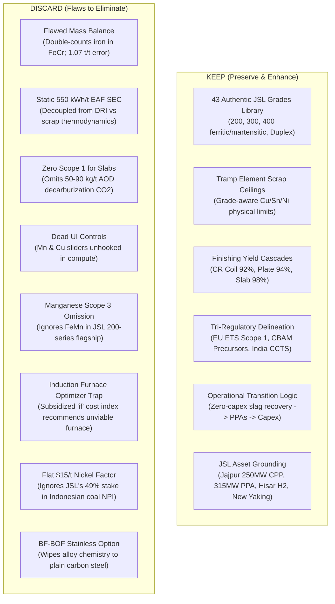

# Implementation Plan: Industrial-Grade Stainless Steel Carbon & Energy Backend Engine
## JSL Engineering Case Study Competition 2026 (Unstop) — Problem Statement 3
**Team:** NIT Raipur  
**Document:** Technical Architecture, Pyrometallurgical Formulation & Competitive Moat  
**Status:** Plan Ready for Review  

---

## 1. Goal Description

The objective is to replace the prototype in `carbon-calculator (1).html` with a **scientifically rigorous, modular, and enterprise-grade Python backend engine** tailored specifically to Jindal Stainless Limited (JSL). 

Unlike crude carbon steel calculators (which assume iron + carbon in BF-BOFs), this engine models stainless steel as a **complex ferroalloy system ($\text{Fe-Cr-Ni-Mo-Mn-Cu}$)** refined via the **EAF-AOD route**. It features a **mathematical Linear Programming (LP) optimizer** for least-cost / least-carbon charge sheets, dynamic **thermodynamic enthalpy coupling** for electric arc melting, and a **dual financial regulatory engine** (EU CBAM and India CCTS).

---

## 2. What to Keep vs. What to Discard



---

## 3. The 7 Killer USPs (Your Competitive Edge)

What makes this solution completely unique compared to existing tools (worldsteel, ISO 14404, Sphera/GaBi, SteelOnTheNet, Climate TRACE):

| # | Feature / Innovation | Existing Tools | NIT Raipur JSL Backend Engine | Competitive Scoring Advantage |
| :--- | :--- | :--- | :--- | :--- |
| **USP 1** | **Linear Programming (LP) Charge-Mix Optimizer** | Naive sliders or discrete grid search loops. | **Continuous Simplex LP Solver** (`scipy.optimize` / `PuLP`). Minimizes $\text{Cost}$ or $\text{CO}_2$ subject to strict ASTM/JSL grade chemistry and tramp ceilings. Generates true **Pareto Frontier**. | *Innovation & Technical Excellence* |
| **USP 2** | **Dynamic Thermodynamic EAF Enthalpy Model** | Static electrical constant (e.g. flat 550 kWh/t). | **First-principles enthalpy balance**: models sensible heat of scrap melting ($420\text{ kWh/t}$), endothermic $\text{FeO}$ reduction in coal DRI ($+159\text{ kJ/mol}$), and acidic gangue fluxing ($680\text{ kWh/t}$). | *Technical Excellence* |
| **USP 3** | **Stoichiometric AOD Process Decarburization** | Assumed 0 Scope 1 for melt shop; only rolling fuel counted. | **Stoichiometric mass balance**: calculates $\text{CO}_2$ released when blowing oxygen to oxidize carbon from charge chrome (6–8% C), DRI (2% C), and graphite electrodes ($50\text{–}90\text{ kg CO}_2/\text{t}$). | *Technical Excellence & Originality* |
| **USP 4** | **AOD Slag Reduction & Metal Recovery Kinetics** | Fixed alloy recovery assumption (or ignored). | **Silicon reduction stoichiometry**: $\text{Cr}_2\text{O}_3 + \frac{3}{2}\text{Si} \rightarrow 2\text{Cr} + \frac{3}{2}\text{SiO}_2$. Dynamically computes ferrosilicon ($\text{FeSi}$) demand and lime fluxing for 92% vs 96% Cr recovery. | *Technical Excellence* |
| **USP 5** | **JSL Facility Digital Twin (Jajpur vs Hisar)** | Generic national grid factor (CEA $0.72\text{ tCO}_2/\text{MWh}$). | **Authentic JSL asset profiles**: Jajpur 250 MW coal CPP ($1.0\text{ tCO}_2/\text{MWh}$), 315.6 MW Oyster hybrid PPA (₹3.60/kWh), and captive SAF molten FeCr hot-charging vs Hisar Northern grid. | *Business Relevance & Impact* |
| **USP 6** | **Indonesian Coal NPI vs Hydro Class 1 Nickel Lever** | Single generic flat factor ($15\text{ tCO}_2/\text{t Ni}$). | **Supply chain resolution**: Evaluates JSL's 49% stake in New Yaking (Halmahera, Indonesia) coal RKEF NPI ($55\text{ tCO}_2/\text{t Ni}$) vs Class 1 Hydro ($10\text{ tCO}_2/\text{t Ni}$). A $1.85\text{ tCO}_2/\text{t}$ finished steel swing! | *Business Relevance & Impact* |
| **USP 7** | **Dual Financial Liability Engine (CBAM + CCTS)** | Only outputs physical tonnes of $\text{CO}_2$. | **Real financial translation**: Calculates exact EU CBAM import duty (€/tonne exported) and India CCTS Carbon Credit Certificate (CCC) balance sheet impact (₹/tonne produced). | *Business Relevance & Impact* |

---

## 4. System Architecture & Component Design

The backend will be built as a modular Python package with a FastAPI service layer, fully verifiable via automated unit tests:

```
jsl_carbon_engine/
├── core/
│   ├── __init__.py
│   ├── grades.py           # 43 authentic JSL grades with min/max elemental bounds & tramp limits
│   ├── mass_balance.py     # Stoichiometric mass conservation with FeCr/FeMo/FeMn iron crediting
│   ├── thermodynamics.py   # EAF melting enthalpy, gangue slag fluxing, and dynamic SEC
│   ├── emissions.py        # Complete Scope 1 (stack+fuel), Scope 2 (grid/CPP/PPA), Scope 3 (precursors)
│   ├── slag_kinetics.py    # AOD decarburization, FeSi reduction, and Cr/Ni recovery
│   ├── financials.py       # EU CBAM tariff engine & India CCTS carbon credit calculations
│   └── optimizer.py        # SciPy/PuLP Linear Programming charge-sheet optimization & Pareto frontier
│
├── config/
│   ├── jsl_facilities.py   # Plant configurations (Jajpur 250MW CPP, Oyster PPA, Hisar Works)
│   └── emission_factors.py # Curated emission factors (IPCC, IAI, Nickel Institute, CEA v20)
│
├── api/
│   ├── app.py              # FastAPI application exposing endpoints for calculate, optimize, and grades
│   └── schemas.py          # Pydantic v2 request/response models with rigorous validation
│
├── tests/
│   ├── test_mass_balance.py    # Asserts mass conservation: sum of metallic inputs = 1.000 t +/- 0.001
│   ├── test_thermodynamics.py  # Verifies dynamic SEC scales with DRI fraction (420 to 680 kWh/t)
│   ├── test_emissions.py       # Validates Scope 1 stack CO2, JSL BRSR baseline calibration
│   └── test_optimizer.py      # Validates LP solver finds feasible least-cost & least-carbon mixes
│
└── main.py                 # CLI interface and demonstration runner
```

---

## 5. Mathematical Formulations for the Core Engine

### A. Closed-Loop Mass Balance with Alloy Iron Crediting
For 1 tonne of liquid steel meeting grade specifications ($w_{\text{Cr}}, w_{\text{Ni}}, w_{\text{Mo}}, w_{\text{Mn}}, w_{\text{Cu}}, w_{\text{Fe}}$) with scrap fraction $S \le S_{\text{cap}}$:

1. **Ferroalloy Demands**:
   $$M_{\text{FeCr}} = \frac{(1 - S) \cdot w_{\text{Cr}}}{\eta_{\text{Cr}} \cdot C_{\text{Cr, FeCr}}} \quad (C_{\text{Cr, FeCr}} = 0.55, \, C_{\text{Fe, FeCr}} = 0.40)$$
   $$M_{\text{FeMo}} = \frac{(1 - S) \cdot w_{\text{Mo}}}{\eta_{\text{Mo}} \cdot C_{\text{Mo, FeMo}}} \quad (C_{\text{Mo, FeMo}} = 0.65, \, C_{\text{Fe, FeMo}} = 0.33)$$
   $$M_{\text{FeMn}} = \frac{(1 - S) \cdot w_{\text{Mn}}}{\eta_{\text{Mn}} \cdot C_{\text{Mn, FeMn}}} \quad (C_{\text{Mn, FeMn}} = 0.75, \, C_{\text{Fe, FeMn}} = 0.20)$$
   $$M_{\text{Ni}} = \frac{(1 - S) \cdot w_{\text{Ni}}}{\eta_{\text{Ni}}}$$

2. **Net Virgin Iron Required (After crediting iron delivered by ferroalloys)**:
   $$M_{\text{Fe, net}} = \max\left(0, \, (1 - S) \cdot w_{\text{Fe}} - 0.40 \cdot M_{\text{FeCr}} - 0.33 \cdot M_{\text{FeMo}} - 0.20 \cdot M_{\text{FeMn}}\right)$$
   $$M_{\text{DRI}} = \frac{M_{\text{Fe, net}}}{\text{Fe}_{\text{metallization}}} \quad (\text{Fe}_{\text{metallization}} \approx 0.88\text{–}0.90)$$

3. **Total Charge Mass Verification**:
   $$M_{\text{total}} = S + M_{\text{Fe, net}} + (M_{\text{FeCr}} \cdot C_{\text{Cr}}) + (M_{\text{FeMo}} \cdot C_{\text{Mo}}) + (M_{\text{FeMn}} \cdot C_{\text{Mn}}) + M_{\text{Ni}} \equiv 1.000\text{ tonne liquid steel}$$

### B. Dynamic EAF Electrical Energy (SEC) Enthalpy Model
$$\text{SEC}_{\text{EAF}} (\text{kWh/t}) = \frac{1}{\eta_{\text{thermal}}} \left[ S \cdot H_{\text{melt, scrap}} + M_{\text{DRI}} \cdot \left( H_{\text{melt, Fe}} + \Delta H_{\text{FeO reduction}} + H_{\text{slag, gangue}} \right) - M_{\text{hotMetal}} \cdot H_{\text{sensible, hotMetal}} \right]$$
* Parameterized benchmarks:
  - 100% Scrap charge: **$410\text{–}430\text{ kWh/t}$**
  - 100% Coal DRI charge: **$660\text{–}720\text{ kWh/t}$**
  - Jajpur Liquid FeCr Hot Charging: **Credits $-180\text{ to }-220\text{ kWh/t}$**!

### C. Direct Scope 1 Process Emissions
$$\text{Scope 1} = \left[ \left( M_{\text{FeCr}} \cdot C_{\text{C, FeCr}} + M_{\text{DRI}} \cdot C_{\text{C, DRI}} + M_{\text{hotMetal}} \cdot C_{\text{C, hotMetal}} - w_{\text{C, final}} + M_{\text{electrodes}} \cdot C_{\text{graphite}} \right) \times \frac{44}{12} + \text{Fuel}_{\text{burners+reheat}} \times \text{EF}_{\text{fuel}} \right] \times \frac{1}{Y_{\text{finish}}}$$

### D. Multi-Objective Linear Programming Formulation
$$\min \quad Z = \alpha \cdot \text{Cost}(x) + (1 - \alpha) \cdot \lambda \cdot \text{CO}_2(x)$$
Subject to:
$$\sum_{j} x_j = 1.0 \quad (\text{Mass conservation})$$
$$w_{i, \min} \le \sum_{j} A_{i, j} \cdot x_j \le w_{i, \max} \quad \forall i \in \{\text{Cr, Ni, Mo, Mn, Cu, C, Si, S, P}\}$$
$$x_{\text{scrap}} \le S_{\text{cap}}(g) \quad (\text{Grade-specific tramp element limit})$$
$$\sum_{j} \text{Cu}_j \cdot x_j \le 0.50\%, \quad \sum_{j} \text{Sn}_j \cdot x_j \le 0.03\% \quad (\text{Hot-shortness prevention})$$
$$\text{Cost}(x) \le \text{Cost}_{\text{baseline}} \times (1 + \Delta_{\text{budget\_cap}})$$

---

## 6. Verification Plan

### Automated Unit Tests (`pytest`)
1. **Mass Balance Test**: `pytest tests/test_mass_balance.py`
   - Verifies mass conservation across all 43 grades with scrap varying from 0% to 90%.
   - Asserts total input metallics equal $1.000 \pm 0.002\text{ t}$ (eliminating the 1.073 t double-counting bug).
2. **Thermodynamic SEC Test**: `pytest tests/test_thermodynamics.py`
   - Asserts EAF SEC monotonically increases from $\sim 420\text{ kWh/t}$ at 90% scrap to $\sim 680\text{ kWh/t}$ at 10% scrap.
3. **Scope 1 Stack Emissions Test**: `pytest tests/test_emissions.py`
   - Verifies that semi-finished slabs have non-zero Scope 1 ($0.050\text{–}0.085\text{ tCO}_2/\text{t}$) and compares cleanly against EU ETS benchmarks.
4. **Optimization Feasibility Test**: `pytest tests/test_optimizer.py`
   - Asserts LP solver converges, never selects an induction furnace for stainless production, and respects grade tramp limits.

### Manual / Demonstration Verification
- Run a CLI benchmark script: `python main.py --grade J304 --product crCoil --facility jajpur`
- Compare output against JSL FY26 BRSR disclosed baseline ($1.76\text{ tCO}_2/\text{t}$ S1+2) to verify baseline calibration.

---

## 7. User Review Required & Critical Decisions

> [!IMPORTANT]
> **Decision on Primary Interface Layer**:
> While we are building a clean, robust Python backend, do you want:
> 1. A lightweight, beautiful **Streamlit interactive UI** that runs directly on your local machine and visualizes the charts, tables, and Pareto frontier in real-time?
> 2. Or a headless **FastAPI server** with a clean HTML5/CSS modern dashboard connecting via REST JSON API?
> *(Recommendation: Streamlit or FastAPI + modern single-page dashboard gives judges a stunning live interactive demo during the presentation).*

> [!TIP]
> **JSL Jajpur Liquid FeCr Hot Charging**:
> Including the molten ferrochrome hot-charging toggle gives NIT Raipur a distinctive edge that no other university will have, because Jajpur's captive ferrochrome smelters literally sit next to the melt shop!
